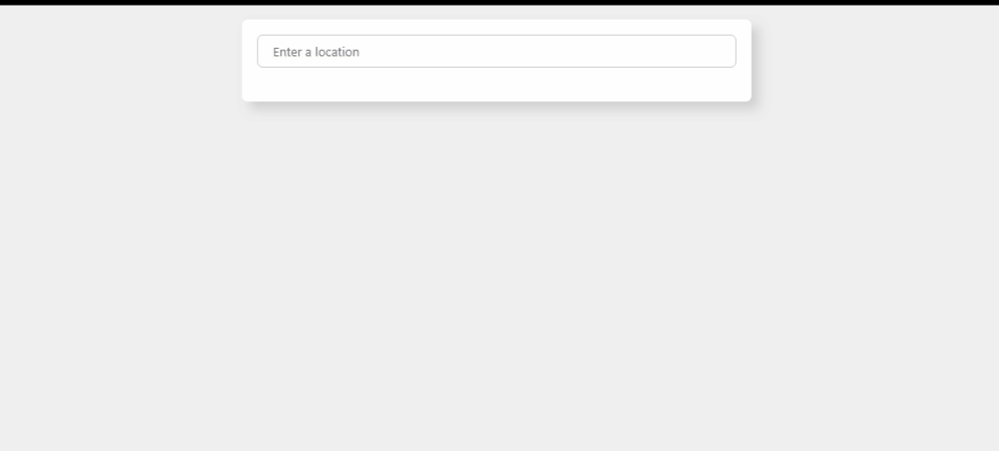

# react-auto-complete-address-fields

This is a react component that creates address fields(Country, City, Zip Code, etc.) due to different addresses from different countries via Google Autocomplete. 

### Installing

```
npm i react-auto-complete-address-fields --save
```

You can include address fields as you want such as "route", "locality", etc and a callback function that you can customize the address data, deriven from Google Autocomplete. You should also include Google API key as a prop for Google Autocomplete.

### Where is 'Père Lachaise Cemetery'?


### Props
- **apiKey** -> You can add your Google API Key by using this prop. You can get your Google API Key from the link below:
	https://developers.google.com/maps/documentation/javascript/get-api-key
- **fields**	->	You can specify the address format by using this prop.
	- **locality**	->	You can select this fields as "locality" for US address format or change it to another address component for a different country.
	- **cityOrState** 	->	You can set this prop as "administrative_area_level_1" to create "City" field for the given address.
	- **postalcode** 	-> You can set this prop as "postal_code" to create "Zip Code" field for the given address.	
	- **country** 	->	You can set this prop as "country" to create "Country" field for the given address.
- **callbackFunction**	->	You can use callback function to customize the address data that deriven from **google.maps.places.Autocomplete** method.

### Usage

```
import  React  from  'react'
import GoogleAutoComplete from 'react-auto-complete-address-fields';
import 'react-auto-complete-address-fields/build/GoogleAutoComplete.css';

class  Example  extends  React.Component  {
	constructor()  {
		super()
		this.callbackFunc = this.callbackFunc.bind(this)

	}

	callbackFunc  = ( autoCompleteData ) => {
		//You can use the address data, passed by autocomplete as you want.
	}

	render()  {
		
		return  (
		<GoogleAutoComplete
		      apiKey="YOUR_API_KEY"
		      id = 'location'
		      fields= {{
		        streetAddress: "route",
		        streetAddress2: "administrative_area_level_4",
		        locality: "locality",
		        cityOrState: "administrative_area_level_1",
		        postalcode: "postal_code",
		        country: "country"
		      }}
		      callbackFunction={this.callbackFunc}
		      />

		)

	}

}

export  default  Example
```

## Motivation

This component is created due to the variation of address formats all around the world. By using this react component users can create different address fields due to their wishes.
